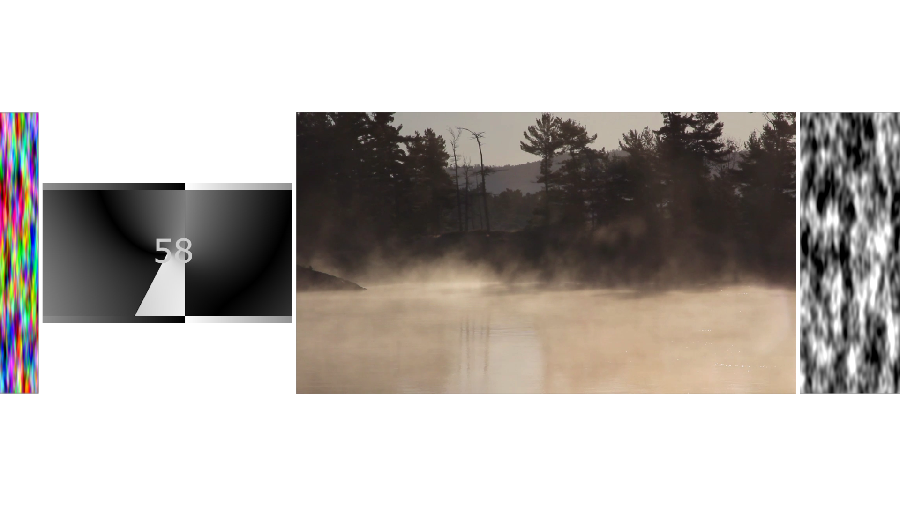

# TOPs-stacker
TouchDesigner component, which allows to align multiple inputs linearly (vertically and horizontally)

# Overview

# Parameters

* **Number of inputs** - (int) The number of COMP inputs
* **Axis** - (Menu) Selection horizontal / vertical combination
* **Justify** - (Menu) Alignment
* **Spacing (px)** - (int) Spacing between nearby TOPs
* **Also, each input can be separately stretched to the full width/height**

* CPU version uses more CPU resources
* GPU version uses more GPU resources

# Notes

- [ ] Fix mouse scrolling "Num inputs" parameter bug
